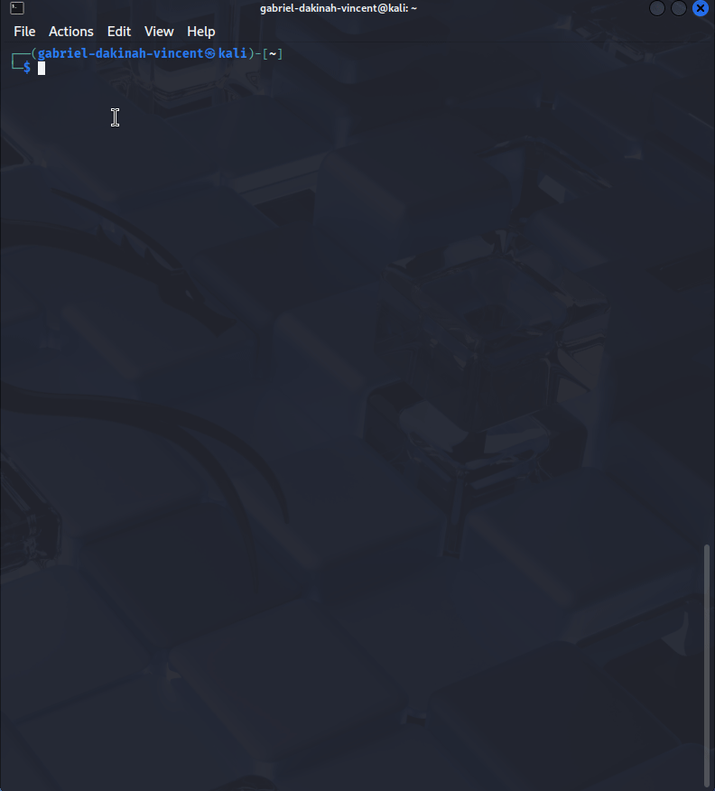
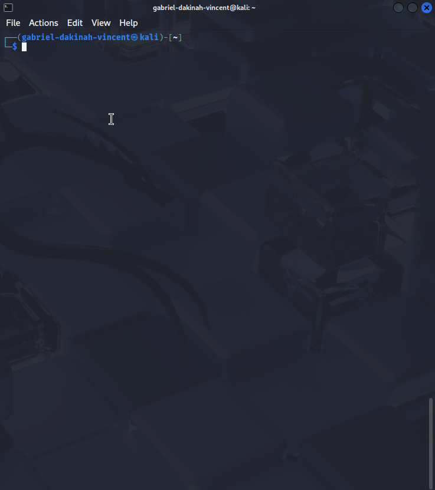
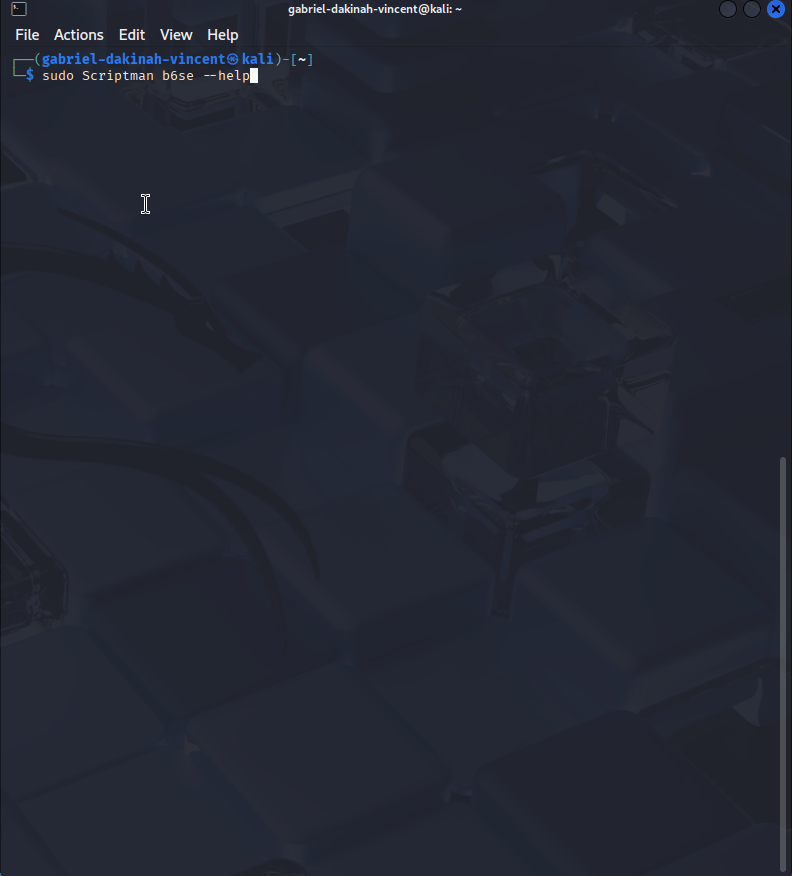
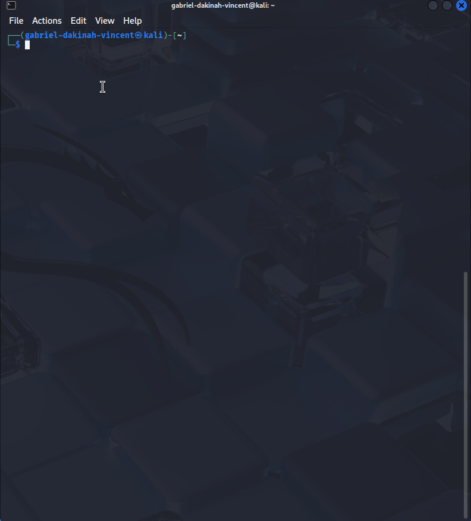
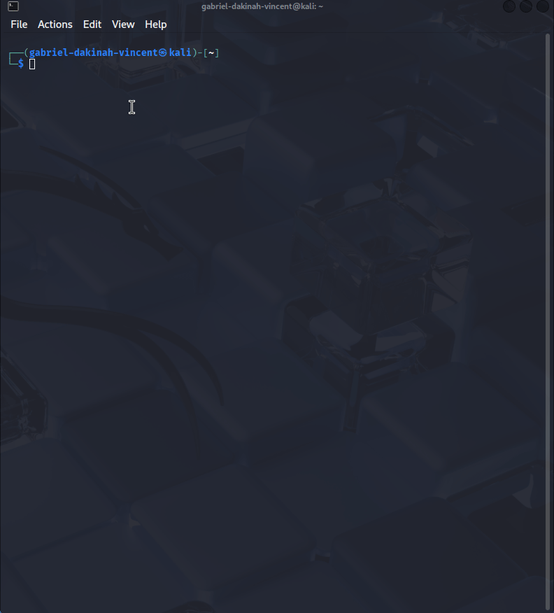
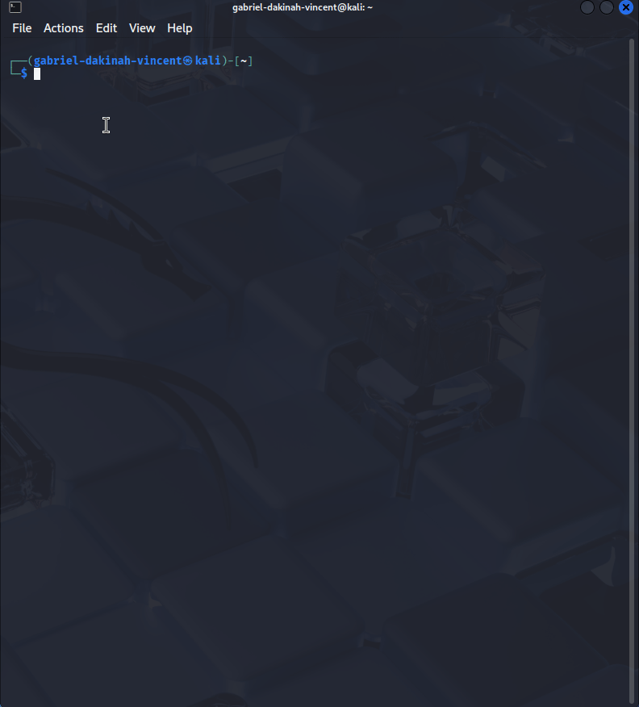
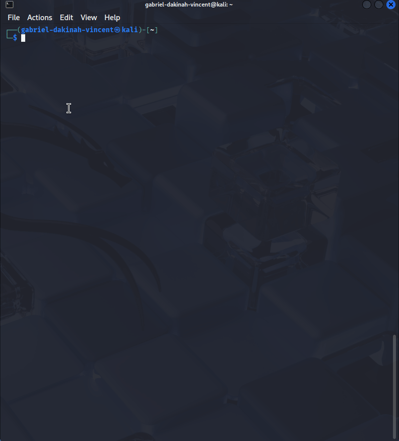
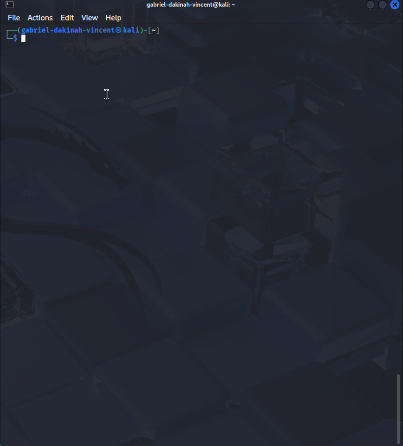
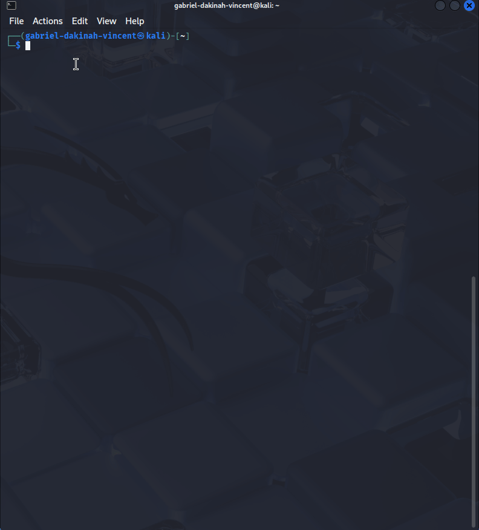

# Scriptman  
**Current Version:** 1.3.0  
**Author:** Gabriel Dakinah Vincent  
**License:** MIT  

---

## Table of Contents
- [Quick Start](#quick-start)
- [Overview](#overview)
- [Features](#features)
- [Installation](#installation)
- [Usage](#usage)
- [Direct Execution](#direct-execution)
- [Passing Arguments](#passing-arguments)
- [Useful Links](#useful-links)
- [Examples](#examples)
- [FAQ](#faq)
- [Contribution](#contribution)
- [License](#license)
- [Acknowledgments](#acknowledgments)
- [Contact](#contact)
- [Changelog](#changelog)

---

## Quick Start

Run Scriptman directly from the internet with one command:

```bash
curl -s https://raw.githubusercontent.com/Gabriel-Dakinah-Vincent/Bash-exercises/refs/heads/b6se_/Scriptman | bash -s -- --help
```


⸻

## Overview

**Scriptman** is a modular Bash-based script launcher designed to execute and test other scripts directly from the internet — no need to clone repositories.

With the **b6se.sh** integration, it now supports:

- Secure file operations  
- Multi-format compression/decompression (`.tar.gz`, `.zip`, `.7z`)  
- Base64 encoding/decoding  
- AES encryption/decryption  
- Secure HTTP file serving  

All through the same unified CLI interface.

⸻

## Features

### Core Features

- 🧩 **Modular Execution** – Run supported scripts (extract-aliases, b6se, etc.) locally or remotely.
- 🔐 **b6se Integration** – Secure file compression, encryption, and HTTP file serving.
- ⚡ **Multi-Format Compression Support ✅** – Automatically handles `.tar.gz`, `.zip`, `.7z` archives without additional flags.
- ⚙️ **Dynamic Configuration** – Automatically generates missing config files.
- 📁 **Smart Directories** – Uses safe, writable directories instead of `/home`.
- 💬 **Interactive & Non-interactive** – Supports menu-driven and direct argument execution.
- 🌐 **Remote Testing Ready** – Fully works with `curl | bash` for live testing or CI/CD pipelines.

⸻

## Installation

No installation is required — everything runs directly in your shell.

To make it permanent:

```bash
sudo curl -s -o /usr/local/bin/Scriptman https://raw.githubusercontent.com/Gabriel-Dakinah-Vincent/Bash-exercises/refs/heads/b6se_/Scriptman
```
```bash
sudo chmod +x /usr/local/bin/Scriptman
```

Now you can use commands like:
```bash
Scriptman ea -q -o output.html
```
```bash
Scriptman rp
```
```bash
Scriptman b6se --help
```

⸻

## Usage

### Interactive Mode

Run without arguments to open the CLI menu:
```bash
bash Scriptman
```
Menu options include:
	•	ea → Extract Aliases
	•	rp → Recover Passwords (coming soon)
	•	exit → Quit Scriptman

#### Example Menu:

What do you want to test?
1. Extract Aliases: ea
2. Recover Passwords: rp
3. Exit: exit
Please enter your choice (ea/rp/exit):


⸻

## Direct Execution
```bash
curl -s https://raw.githubusercontent.com/Gabriel-Dakinah-Vincent/Bash-exercises/refs/heads/b6se_/Scriptman | bash -s -- ea -h
```

```bash
curl -s https://raw.githubusercontent.com/Gabriel-Dakinah-Vincent/Bash-exercises/refs/heads/b6se_/Scriptman | bash -s -- rp --help
```

```bash
curl -s https://raw.githubusercontent.com/Gabriel-Dakinah-Vincent/Bash-exercises/refs/heads/b6se_/Scriptman | sudo bash -s -- b6se --version
```

⸻

## Passing Arguments

### Local Execution

```bash
bash Scriptman ea -q -o aliases.md
```
```bash
bash Scriptman b6se --encrypt file.txt --password mySecret123
```
```bash
bash Scriptman b6se -c myfolder  
```
```bash
bash Scriptman b6se -x archive.zip 
```
```bash
bash Scriptman b6se -x archive.7z
```
## Remote Execution
```bash
curl -s https://raw.githubusercontent.com/Gabriel-Dakinah-Vincent/Bash-exercises/refs/heads/b6se_/Scriptman | bash -s -- ea -q -o aliases.md
```

```bash
curl -s https://raw.githubusercontent.com/Gabriel-Dakinah-Vincent/Bash-exercises/refs/heads/b6se_/Scriptman | bash -s -- rp
```

```bash
curl -s https://raw.githubusercontent.com/Gabriel-Dakinah-Vincent/Bash-exercises/refs/heads/b6se_/Scriptman | sudo bash -s -- b6se -c myfolder
```

⸻

## Useful Links

| **Description** | **Command** |
|-----------------|-------------|
| Displays Scriptman help and usage | <details><summary>Show Command</summary><pre><code>curl -s https://raw.githubusercontent.com/Gabriel-Dakinah-Vincent/Bash-exercises/refs/heads/b6se_/Scriptman \| bash -s -- --help</code></pre></details> |
| Run Extract Aliases | <details><summary>Show Command</summary><pre><code>curl -s curl -s https://raw.githubusercontent.com/Gabriel-Dakinah-Vincent/Bash-exercises/refs/heads/b6se_/Scriptman \| bash -s -- ea -q -o aliases.html</code></pre></details> |
| Display CLI Utility  help and usage | <details><summary>Show Command</summary><pre><code>curl -s https://raw.githubusercontent.com/Gabriel-Dakinah-Vincent/Bash-exercises/refs/heads/b6se_/Scriptman \| sudo bash -s -- b6se --help</code></pre></details> |
| Serve file via HTTP | <details><summary>Show Command</summary><pre><code> curl -s https://raw.githubusercontent.com/Gabriel-Dakinah-Vincent/Bash-exercises/refs/heads/b6se_/Scriptman \| sudo bash -s -- b6se --serve</code></pre></details> |

## Examples

Example 1: Extract Aliases
```bash
bash Scriptman ea
```
## Output:

Aliases have been written to output.md
| Alias | Command |
|-------|----------|
| ll    | ls -la   |


⸻

### Example 2: Run b6se Secure CLI
```bash
bash Scriptman b6se --serve ~/Documents
```
```bash
bash Scriptman b6se -c myfolder 
```
```bash
bash Scriptman b6se -x archive.tar.gz 
```
```bash
bash Scriptman b6se -x archive.zip  
```
```bash
bash Scriptman b6se -x archive.7z  
```
## Output:

[INFO] 2025-10-07 20:30:26 Starting HTTP server for ~/Documents on port 8080
[INFO] Server started (PID 3495)
Press Ctrl+C to stop


⸻

## FAQ

Q: What Bash version is required?
A: Bash 4.0 or higher.

Q: What if I get a “Permission denied” error?
A: Run with a writable path (like ~/Documents) or use sudo.

Q: Does it work without cloning?
A: Yes — all commands work remotely via curl | bash.

Q: Can I customize config values?
A: Yes — edit config/config.ini after the first run.

Q: Which compression formats are supported?
A: .tar.gz, .zip, and .7z (auto-detected, no extra flags required).

⸻

## Contribution

Contributions are welcome!
Fork the repository and submit a pull request with a clear description of your changes.
Please follow the existing file and folder structure for consistency.

⸻

## License

This project is licensed under the MIT License.
See the LICENSE file for full details.

⸻

## Acknowledgments
	•	Thanks to the open-source community for their continuous support.
	•	Inspired by real-world Bash automation and DevSecOps practices.

⸻

## Contact

For questions or support:
📧 Open an Issue or join the Discussions tab on GitHub.
🧠 Author: Gabriel Dakinah Vincent

⸻

## Changelog

Version 1.3.0 — Multi-Format Compression Update
	•	Added support for .tar.gz, .zip, and .7z archives
	•	Introduced automatic format detection
	•	Improved error handling and graceful fallback for missing tools
	•	Enhanced compatibility for Linux and WSL environments
	•	Fully integrated with Scriptman CLI for both local and remote execution

----
